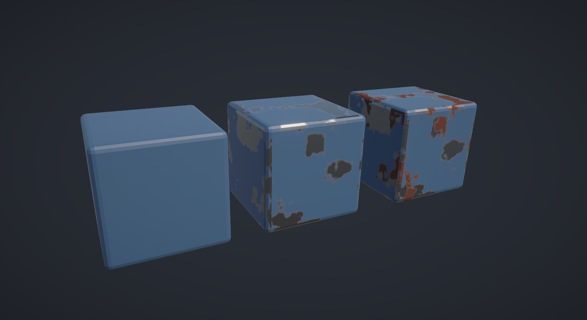

# Procedural Weathered Metal Shader

A procedural weathering shader built in Unity URP using ShaderLab and HLSL. It simulates chipped paint, exposed metal, and rust, with adjustable material parameters.

## Preview



*Left to right: Clean Paint → Paint Chipping & Edge Wear → Full Weathering.*

## Features

- **Procedural paint chipping:** Uses layered value noise (FBM) to generate irregular wear patterns.
- **Geometry-aware edge wear:** Uses an edge mask baked in Blender to concentrate wear around bevels and exposed edges.
- **Procedural rust:** Generates secondary noise-based rust patterns within exposed metal regions.
- **PBR material blending:** Blends albedo, metallic, and smoothness values across paint, bare metal, and rust.
- **Adjustable parameters:** Exposes wear threshold, edge wear strength, rust coverage, colors, and smoothness settings in Unity's Material Inspector.

## Implementation

The shader combines procedural noise with a baked edge mask to calculate paint wear:

```hlsl
float combinedNoise = noise + edgeMask * _EdgeWearStrength;

float wearMask = smoothstep(
    _WearThreshold - 0.02,
    _WearThreshold + 0.02,
    combinedNoise
);
```

The resulting mask controls the transition between painted and exposed metal. A separate noise-based mask adds rust to worn regions.

## Tools

- Unity 2021.3 LTS / Universal Render Pipeline
- ShaderLab / HLSL
- Blender (mesh preparation, UV mapping, and edge mask baking)

## Notes

The included edge mask was baked for the demonstration cube. Other meshes require a corresponding edge mask and matching UVs for geometry-aware wear.

The current shader uses a custom URP forward pass and has been tested with Depth Priming disabled.
